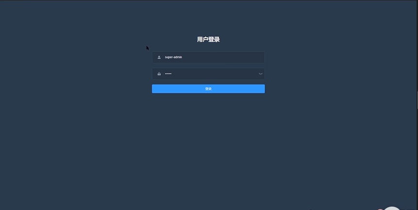

# imooc-admin-

## 初始配置
* vue router
* pina
* element-plus
* element-plus/icon
* tailwindcss

## 登录
### 登录页面


### 表单验证

### 封装请求
不同开发环境下，请求的服务不同
axios


先暂时不考虑不同的开发环境，就是请求真实服务器上的数据
```js
const instance = axios.create({
    baseURL: 'https://some-domain.com/api/',
    timeout: 1000,
    headers: {'X-Custom-Header': 'foobar'}
});
```

### 保存token和鉴权跳转


## 主页面

### 主页面绘制
* aside
* header
* main


### 获取用户信息


### header
#### 头像
